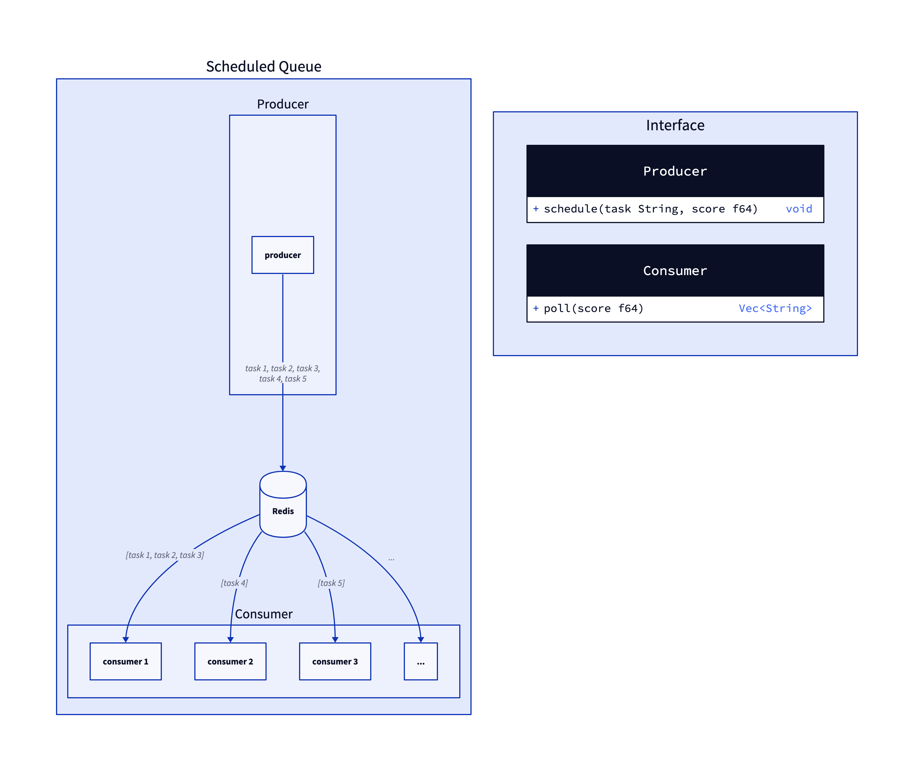

# Taskline

[](https://crates.io/crates/taskline)
[](https://github.com/daxartio/taskline/actions)
<!-- [](https://docs.rs/taskline) -->
<!-- [](https://coveralls.io/github/daxartio/taskline?branch=main) -->

The library allows to create scheduled tasks via Redis for Rust.

```rust
producer.schedule("Hello!".to_string(), now() + 1000.).await;

loop {
    let tasks = consumer.poll(now()).await.unwrap();
    if tasks.is_empty() {
        sleep(Duration::from_millis(100)).await;
        continue;
    }
    for task in tasks {
        println!("Consumed {:?}", task);
    }
}
```

That means the Consumed will be printed in 1 second.

You can customize a format of an event for redis. Write your wrapper over [RedisBackend](src/backends/redis.rs). See [redis_json backend](src/backends/redis_json.rs).



## Installation

### Cargo

```
cargo add taskline
```

## License

* [MIT LICENSE](LICENSE)

## Contribution

[CONTRIBUTING.md](CONTRIBUTING.md)
